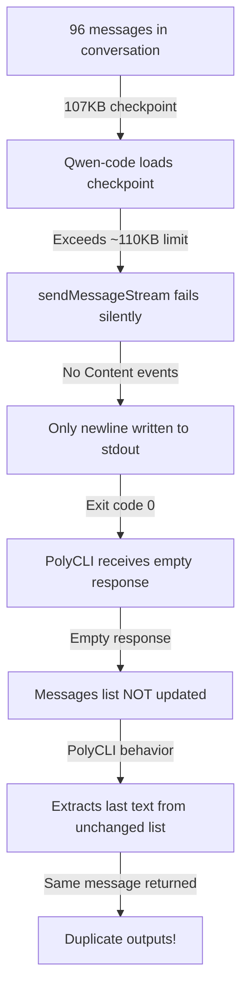

# Investigation Summary: The Qwen-Code Silent Failure Mystery

## Executive Summary

What initially appeared as a simple "duplicate output bug" in agent.py turned out to be a deep, systemic issue: **qwen-code silently fails when checkpoint files exceed ~110KB**, returning empty stdout while reporting success (exit code 0). This caused the agent loop to reuse previous outputs, creating the illusion of a duplicate output bug.

## The Journey: From Symptom to Root Cause

### Initial Symptom: "Duplicate Output Bug"
- **Observation**: Adjacent outputs in agent.py were identical
- **Initial hypothesis**: Variable overwriting issue at line 74
- **Reality**: The agent was receiving empty responses from qwen-code and falling back to previous results

### The Investigation Spiral

#### 1. Early Stop Problem
- Attempted to fix with structured output (Pydantic models)
- Added ReviewResult model to enforce validation
- This was treating a symptom, not the cause

#### 2. Grok-4 Compatibility Issues  
- Discovered grok-4 fails with structured output via OpenRouter
- Misleading error: "You requested up to 230278 tokens, but can only afford 220711"
- Implemented retry mechanisms with instructor library
- Still didn't solve the core issue

#### 3. The Breakthrough: Empty Stdout Discovery
- **Critical observation**: Subprocess returns code 0 but stdout only contains newline
- **User insight**: "Could we count like, how many tokens(approximated by characters) are there in the 96 messages"
- This led to the discovery of the size limitation

#### 4. Systematic Proof
Through exhaustive testing with different truncation strategies, we proved:
- The failure is **purely size-based** (~110KB threshold)
- It's **not** about message formatting
- It's **not** about specific message content
- It's **not** about message order

## The Root Cause Revealed

### Location in Qwen-Code Source
File: `/home/jeffry/Codebase/qwen-code/packages/cli/src/nonInteractiveCli.ts`

```typescript
// Lines 137-154: Event processing loop
for await (const event of responseStream) {
    if (event.type === GeminiEventType.Content) {
        process.stdout.write(event.value);  // Only writes on Content events
    } else if (event.type === GeminiEventType.ToolCallRequest) {
        // Handle tool calls
    }
}

// Lines 199-200: The silent failure point
process.stdout.write('\n');  // Just writes newline
return;                      // Returns "successfully"
```

### The Mechanism of Failure
1. Large checkpoint (>110KB) is loaded
2. `sendMessageStream` is called with the large context
3. **No Content events are generated** (likely due to model context limits)
4. Loop completes without writing any actual content
5. Function writes a single newline and returns with exit code 0
6. PolyCLI's agent.py receives empty response
7. **Empty response means messages list doesn't update**
8. PolyCLI extracts last text message from unchanged list
9. Returns the same previous message as "result"
10. Creates the "duplicate output" phenomenon

## Proof Through Testing

### Test Matrix Results

| Test Strategy | Threshold | Behavior |
|--------------|-----------|----------|
| Keep first N messages | ~70 msgs (102.9 KB) ✅ | ~75 msgs (113.8 KB) ❌ |
| Keep last N messages | ~60 msgs (98.9 KB) ✅ | ~65 msgs (113.8 KB) ❌ |
| Random sampling | ~60 msgs (95.2 KB) ✅ | ~70 msgs (111.4 KB) ❌ |
| Alternating messages | 48 even (76.5 KB) ✅ | Would fail at ~110KB |
| Content truncation | <100KB ✅ | >110KB ❌ |

### Key Evidence
- **Consistent threshold**: ~110-113KB regardless of truncation method
- **Silent failure**: No error messages, exit code 0
- **Empty output**: Only newline in stdout

## Why This Was So Hard to Find

1. **Misleading success indicators**: Exit code 0 suggested everything worked
2. **No error messages**: Qwen-code didn't report the context limit issue
3. **Cascade of symptoms**: The bug manifested as duplicate outputs, not as subprocess failures
4. **Red herrings**: 
   - Token limit errors from grok-4
   - Structured output compatibility issues
   - Variable overwriting suspicions

## The Complete Picture



### The PolyCLI Behavior
**Critical detail**: The PolyCLI package treats the last text message in the conversation as the result. When qwen-code returns empty output:
1. PolyCLI receives empty response from qwen-code
2. **Messages list is NOT updated** (no new message to add)
3. PolyCLI extracts the last text message from the unchanged list
4. Returns the same previous message as the "result"
5. This creates the "duplication" effect

## Implications

1. **The "duplicate bug" was never about duplicates**: It was about empty responses
2. **Context window limits are enforced silently**: No error reporting
3. **Checkpoint size is critical**: Any conversation >110KB will fail
4. **The investigation path was backwards**: We started at the symptom, took multiple detours, and finally found the root cause

## Solutions

### Immediate Mitigation
```python
# In agent.py - detect empty responses
if len(result.stdout.strip()) == 0:
    raise Exception("Qwen-code returned empty response - likely checkpoint too large")
```

### Proper Fix Options
1. **Truncate message history**: Keep checkpoints under 100KB
2. **Implement sliding window**: Only keep recent N messages
3. **Fix qwen-code**: Handle large contexts gracefully with proper error messages
4. **Use compression**: Reduce checkpoint size while preserving context

## Lessons Learned

1. **Silent failures are the worst failures**: Always validate subprocess output
2. **Exit codes lie**: Success codes don't guarantee actual success
3. **Follow the data**: Counting bytes/characters led to the breakthrough
4. **Test systematically**: Multiple truncation strategies proved it was size, not content
5. **Question assumptions**: The "obvious" duplicate bug wasn't the real problem

## The Irony

We spent hours implementing sophisticated retry mechanisms, structured output validation, and configuration systems - all to work around what was ultimately a simple size limit that was never documented or reported by the failing component.

## Final Verdict

**The duplicate output bug was a ghost** - a symptom of qwen-code's silent failure when checkpoints exceed ~110KB. The real bug was in the error handling (or lack thereof) in qwen-code's nonInteractiveCli.ts, which returns success even when it fails to generate any content.